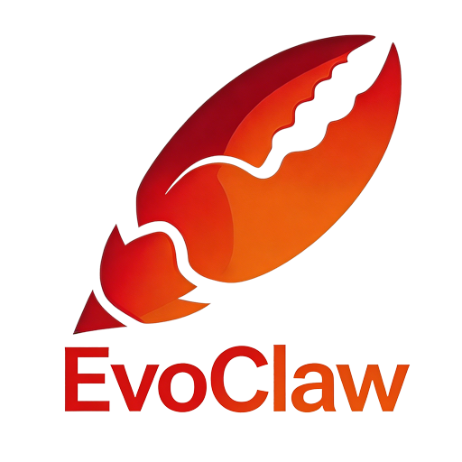

# EvoClaw 部署与配置指南

## 目录

1. [系统要求](#1-系统要求)
2. [Ubuntu 部署](#2-ubuntu-部署)
3. [macOS 部署](#3-macos-部署)
4. [Windows 部署](#4-windows-部署)
5. [初始化配置](#5-初始化配置)
6. [大模型 (LLM) 配置](#6-大模型-llm-配置)
7. [Channel 配置 (飞书/企业微信/个人微信)](#7-channel-配置)
8. [Skill 安装与管理](#8-skill-安装与管理)
9. [验证部署](#9-验证部署)
10. [故障排除](#10-故障排除)

***

## 1. 系统要求

| 项目      | 最低要求                                    | 推荐配置     |
| ------- | --------------------------------------- | -------- |
| Node.js | 20.x                                    | 22.x LTS |
| pnpm    | 9.x                                     | 10.x     |
| 内存      | 2 GB                                    | 8 GB+    |
| 磁盘空间    | 500 MB                                  | 2 GB+    |
| 操作系统    | Ubuntu 22.04+ / macOS 13+ / Windows 10+ | -        |

***

## 2. Ubuntu 部署

### 2.1 安装 Node.js 和 pnpm

```bash
# 方式一：使用 nvm (推荐)
curl -o- https://raw.githubusercontent.com/nvm-sh/nvm/v0.40.0/install.sh | bash
source ~/.bashrc
nvm install 22
nvm use 22

# 安装 pnpm
npm install -g pnpm@10

# 验证安装
node --version   # 应显示 v22.x
pnpm --version   # 应显示 10.x
```

```bash
# 方式二：使用 NodeSource
curl -fsSL https://deb.nodesource.com/setup_22.x | sudo -E bash -
sudo apt-get install -y nodejs
npm install -g pnpm@10
```

### 2.2 安装 Git 并克隆项目

```bash
sudo apt-get install -y git
git clone https://github.com/chydroid/EcoClaw.git
cd evoclaw
```

### 2.3 安装依赖并构建

```bash
pnpm install
pnpm build
```

### 2.4 配置环境变量

```bash
cp .env.example .env
nano .env
```

### 2.5 启动服务

```bash
# 开发模式
pnpm dev

# 生产模式
NODE_ENV=production node apps/server/dist/index.js
```

### 2.6 配置 systemd 自启动 (生产环境)

```bash
sudo nano /etc/systemd/system/evoclaw.service
```

粘贴以下内容：

```ini
[Unit]
Description=EvoClaw - Self-Evolving Agent OS
After=network.target

[Service]
Type=simple
User=evoclaw
WorkingDirectory=/opt/evoclaw
ExecStart=/home/evoclaw/.nvm/versions/node/v22.0.0/bin/node apps/server/dist/index.js
Restart=on-failure
RestartSec=5
Environment=NODE_ENV=production
Environment=EVOCLAW_PORT=17788

[Install]
WantedBy=multi-user.target
```

```bash
sudo systemctl daemon-reload
sudo systemctl enable evoclaw
sudo systemctl start evoclaw
sudo systemctl status evoclaw
```

***

## 3. macOS 部署

### 3.1 安装 Homebrew (如未安装)

```bash
/bin/bash -c "$(curl -fsSL https://raw.githubusercontent.com/Homebrew/install/HEAD/install.sh)"
```

### 3.2 安装 Node.js 和 pnpm

```bash
# 方式一：使用 nvm (推荐)
brew install nvm
mkdir ~/.nvm
echo 'export NVM_DIR="$HOME/.nvm"' >> ~/.zshrc
echo '[ -s "/opt/homebrew/opt/nvm/nvm.sh" ] && \. "/opt/homebrew/opt/nvm/nvm.sh"' >> ~/.zshrc
source ~/.zshrc
nvm install 22
nvm use 22
npm install -g pnpm@10
```

```bash
# 方式二：使用 Homebrew 直接安装
brew install node@22 pnpm
```

### 3.3 克隆项目并安装依赖

```bash
git clone https://github.com/chydroid/EcoClaw.git
cd evoclaw
pnpm install
pnpm build
```

### 3.4 配置并启动

```bash
cp .env.example .env
nano .env
pnpm dev
```

### 3.5 配置 launchd 自启动 (生产环境)

创建 `/Users/yourname/Library/LaunchAgents/com.evoclaw.server.plist`：

```xml
<?xml version="1.0" encoding="UTF-8"?>
<!DOCTYPE plist PUBLIC "-//Apple//DTD PLIST 1.0//EN"
  "http://www.apple.com/DTDs/PropertyList-1.0.dtd">
<plist version="1.0">
<dict>
    <key>Label</key>
    <string>com.evoclaw.server</string>
    <key>ProgramArguments</key>
    <array>
        <string>/opt/homebrew/bin/node</string>
        <string>/Users/yourname/evoclaw/apps/server/dist/index.js</string>
    </array>
    <key>WorkingDirectory</key>
    <string>/Users/yourname/evoclaw</string>
    <key>EnvironmentVariables</key>
    <dict>
        <key>NODE_ENV</key>
        <string>production</string>
        <key>EVOCLAW_PORT</key>
        <string>3000</string>
    </dict>
    <key>RunAtLoad</key>
    <true/>
    <key>KeepAlive</key>
    <true/>
    <key>StandardOutPath</key>
    <string>/Users/yourname/Library/Logs/evoclaw.log</string>
    <key>StandardErrorPath</key>
    <string>/Users/yourname/Library/Logs/evoclaw.err</string>
</dict>
</plist>
```

```bash
launchctl load ~/Library/LaunchAgents/com.evoclaw.server.plist
launchctl list | grep evoclaw
```

***

## 4. Windows 部署

### 4.1 安装 Node.js 和 pnpm

- 访问 <https://nodejs.org> 下载 Node.js 22 LTS 安装包
- 运行安装程序，全部使用默认选项
- 打开 **PowerShell (管理员)** 安装 pnpm：

```powershell
npm install -g pnpm@10
```

或者：

```powershell
iwr https://get.pnpm.io/install.ps1 -useb | iex
```

验证安装：

```powershell
node --version
pnpm --version
```

### 4.2 安装 Git

- 访问 <https://git-scm.com/download/win> 下载并安装

### 4.3 克隆项目并安装依赖

```powershell
git clone hhttps://github.com/chydroid/EcoClaw.git
cd evoclaw
pnpm install
pnpm build
```

### 4.4 配置环境变量

创建 `.env` 文件：

```powershell
New-Item -Path .env -ItemType File
notepad .env
```

### 4.5 启动服务

```powershell
# 开发模式
pnpm dev

# 生产模式
$env:NODE_ENV = "production"
node apps/server/dist/index.js
```

### 4.6 配置 Windows 服务 (生产环境)

使用 PowerShell (管理员)：

```powershell
# 使用 nssm 或 winsw 创建 Windows 服务
# 方式一：使用 winsw
# 下载 WinSW-x64.exe 到 EvoClaw 目录下，重命名为 evoclaw-service.exe
# 创建 evoclaw-service.xml：

@"
<service>
  <id>EvoClaw</id>
  <name>EvoClaw Server</name>
  <description>EvoClaw - Self-Evolving Agent OS</description>
  <executable>node</executable>
  <arguments>apps/server/dist/index.js</arguments>
  <workingdirectory>$pwd</workingdirectory>
  <env name="NODE_ENV" value="production"/>
  <env name="EVOCLAW_PORT" value="3000"/>
  <logmode>rotate</logmode>
</service>
"@ | Out-File -FilePath evoclaw-service.xml -Encoding UTF8

# 注册并启动服务
.\evoclaw-service.exe install
.\evoclaw-service.exe start
```

***

## 5. 初始化配置

编辑 `.env` 文件，配置以下关键参数：

```ini
# 服务器配置
EVOCLAW_PORT=3000
EVOCLAW_HOST=0.0.0.0

# JWT 密钥 (生产环境必须修改为至少16位随机字符串！)
JWT_SECRET=your-production-secret-key-at-least-16-chars

# 进化引擎
EVOCLAW_EVOLUTION_ENABLED=true

# MCP 协议
EVOCLAW_MCP_ENABLED=true

# REST API
EVOCLAW_REST_ENABLED=true
```

***

## 6. 大模型 (LLM) 配置

### 6.1 打开 Web 控制台

启动服务后，在浏览器中访问 `http://localhost:3000`（或服务器 IP:3000）。

### 6.2 进入 LLM 配置页面

点击顶部导航栏的 **LLM** 标签页。

### 6.3 支持的大模型提供商

| 提供商                | 说明                            | 获取 API Key                                                  |
| ------------------ | ----------------------------- | ----------------------------------------------------------- |
| **OpenAI**         | GPT-4o, GPT-4 Turbo, GPT-3.5  | [platform.openai.com](https://platform.openai.com/api-keys) |
| **Anthropic**      | Claude 3 Opus/Sonnet/Haiku    | [console.anthropic.com](https://console.anthropic.com/)     |
| **DeepSeek**       | DeepSeek Chat, DeepSeek Coder | [platform.deepseek.com](https://platform.deepseek.com/)     |
| **Local (Ollama)** | Llama3, Mistral, Qwen2 等      | 本地安装 [ollama.com](https://ollama.com)                       |
| **Custom**         | 任何兼容 OpenAI API 的服务           | -                                                           |

### 6.4 配置步骤

1. 在左侧选中要配置的提供商（如 OpenAI）
2. 打开 **Enable Provider** 开关
3. 填入 **API Key**（本地模型可留空）
4. 确认 **Base URL** 正确
   - OpenAI: `https://api.openai.com/v1`
   - Anthropic: `https://api.anthropic.com/v1`
   - DeepSeek: `https://api.deepseek.com/v1`
   - Ollama 本地: `http://localhost:11434/v1`
5. 选择合适的 **Model**
6. 调整 **Temperature** (0-2，越高越随机)、**Top P**、**Max Tokens**
7. 点击 **Save All** 保存配置

### 6.5 使用本地模型 (Ollama)

```bash
# 安装 Ollama (所有平台)
curl -fsSL https://ollama.com/install.sh | sh

# 拉取模型
ollama pull llama3
ollama pull mistral
ollama pull qwen2

# 验证
ollama list
```

***

## 7. Channel 配置

### 7.1 打开 Channel 配置页面

点击顶部导航栏的 **Channels** 标签页。

### 7.2 飞书 (Feishu/Lark) 配置

1. 在左侧选择 **🐦 Feishu**
2. 按照 Setup Guide 中的步骤操作：
   - 打开 [飞书开放平台](https://open.feishu.cn/) → 创建企业自建应用
   - 添加 **机器人** 能力
   - 配置事件订阅（回调 URL: `https://your-server.com/api/feishu/callback`）
   - 复制 **App ID** 和 **App Secret** 填入对应字段
3. 填入 **Verification Token**（事件订阅验证用）
4. 填入 **Webhook URL**（从飞书机器人 Webhook 地址获取）
5. 设置 **Encrypt Key**（事件加密密钥）
6. 设置 **Bot Name** 和 **Welcome Message**
7. 配置允许的功能特性
8. 点击 **Save All**，然后点击 **Test Connection** 测试

### 7.3 企业微信 (WeCom) 配置

1. 在左侧选择 **💼 Enterprise WeChat**
2. 操作步骤：
   - 登录 [企业微信管理后台](https://work.weixin.qq.com/) → 应用管理 → 自建
   - 创建应用，获取 **Corp ID** (即 App ID)、**Agent ID** 和 **Secret**
   - 在 "接收消息" 中设置回调 URL
   - 设置 **Token** 和 **EncodingAESKey** 用于消息加解密
3. 填入 **Webhook URL** 格式：`https://qyapi.weixin.qq.com/cgi-bin/webhook/send?key=YOUR_KEY`
4. 保存并测试连接

### 7.4 个人微信 (Personal WeChat) 配置

> ⚠️ **警告**: 个人微信自动化可能违反微信使用条款，请自行评估风险并承担相应责任。

1. 在左侧选择 **💬 Personal WeChat**
2. 安装 EvoClaw WeChat Bridge 桥接程序（需要独立设备或模拟器）
3. 运行 Bridge 后扫描二维码登录微信
4. 在 WebSocket URL 中填入 Bridge 的连接地址（默认 `ws://localhost:8765`）
5. 保存配置

### 7.5 用户访问控制

在配置页面的 **Allowed Users** 区域：

- 留空 = 不限制，所有用户可交互
- 添加用户 ID = 仅允许指定用户

***

## 8. Skill 安装与管理

### 8.1 什么是 Skill

EvoClaw 完全兼容 **OpenClaw / ClawHub** 生态的 Skill 格式。Skill 是一个以 `SKILL.md` 为核心的技能包，无需编译，解压即用。

### 8.2 从 ClawHub 获取 Skill

**方法一：Web UI 快捷入口**

1. 打开 EvoClaw Web UI → 点击 **Skills** 标签
2. 在 **Skill Market** 区域点击链接：
   - 🌐 **[clawhub.ai](https://clawhub.ai/)** — 全球 Skill 注册中心
   - 🇨🇳 **[cn.clawhub-mirror.com](https://cn.clawhub-mirror.com/)** — 国内镜像（更快的访问速度）
3. 搜索需要的 Skill
4. 下载 Skill 包（通常是一个包含 `SKILL.md` 的 ZIP 文件或 Git 仓库）

**方法二：Git 克隆**

```bash
# 克隆单个 Skill 到 skills 目录
git clone https://github.com/some-author/some-skill.git skills/some-skill

# 或使用 OpenClaw 官方 registry
openclaw install some-skill
```

**方法三：手动下载**

```bash
# 下载 SKILL.md 并放置到 skills/ 目录
mkdir -p skills/my-custom-skill
curl -o skills/my-custom-skill/SKILL.md https://clawhub.ai/skills/my-custom-skill/raw
```

### 8.3 安装 Skill

EvoClaw 会在启动时自动扫描 `skills/` 目录下的所有 `SKILL.md` 文件并加载。

**目录结构示例：**

```
evoclaw/
├── skills/                    # Skill 根目录
│   ├── pdf-reader/            # Skill 1
│   │   └── SKILL.md
│   ├── weather-fetcher/       # Skill 2
│   │   └── SKILL.md
│   └── my-custom-skill/       # Skill 3 (自定义)
│       └── SKILL.md
```

**安装后验证：**

```bash
# 通过 API 查看已安装的 Skill
curl http://localhost:3000/api/skills

# 或打开 Web UI → Skills 标签查看
```

### 8.4 编写自己的 Skill (SKILL.md 格式)

创建 `skills/my-skill/SKILL.md`：

```markdown
---
name: my-custom-skill
version: 1.0.0
description: 一个自定义示例 Skill
author: your-name
triggers:
  - type: keyword
    pattern: "hello world"
    description: 匹配 "hello world" 关键词时触发
requires: []
config:
  greeting: "Hello from EvoClaw"
metadata:
  openclaw:
    emoji: "🦞"
    homepage: "https://github.com/your-name/my-skill"
    os: ["linux", "macos", "windows"]
    requires:
      env: []
      bins: []
---

## Instructions

当用户说 "hello world" 时，回复 config.greeting 中的问候语。

## Scripts

\`\`\`javascript
// 技能执行的主逻辑
async function execute(params) {
  const greeting = config.greeting || "Hello!";
  return { message: greeting, timestamp: new Date().toISOString() };
}
\`\`\`

## Examples

用户: hello world
EvoClaw: Hello from EvoClaw

## Hooks

\`\`\`javascript
// 安装后执行
async function onInstall() {
  console.log("My Skill installed!");
}
\`\`\`
```

### 8.5 SKILL.md 字段说明

| 字段                                | 必需 | 说明          |
| --------------------------------- | -- | ----------- |
| `name`                            | ✅  | 技能名称，英文标识   |
| `version`                         | ✅  | 语义化版本号      |
| `description`                     | ✅  | 简短描述        |
| `author`                          | ❌  | 作者名         |
| `triggers`                        | ❌  | 触发条件列表      |
| `requires`                        | ❌  | 依赖的其他 Skill |
| `config`                          | ❌  | 默认配置参数      |
| `metadata.openclaw.emoji`         | ❌  | 图标 emoji    |
| `metadata.openclaw.homepage`      | ❌  | 主页链接        |
| `metadata.openclaw.os`            | ❌  | 支持的操作系统     |
| `metadata.openclaw.requires.env`  | ❌  | 需要的环境变量     |
| `metadata.openclaw.requires.bins` | ❌  | 需要的系统二进制    |

### 8.6 Skill 生命周期

每个 Skill 经历以下生命周期：

```
下载 → 安装(install) → 激活(active) → 运行中 → 停用 → 卸载
                                     ↓
                              健康检查 → 状态异常(error) → 自动恢复/重装
```

在 Web UI 的 **Skills** 标签可以看到每个 Skill 的状态（active/error/disabled），以及调用次数和成功率统计。

### 8.7 故障 Skill 处理

如果 Skill 连续执行失败，EvoClaw 会：

1. 记录错误日志到控制台
2. 在 Web UI 标记状态为 `error`
3. 自愈引擎会尝试重置 Skill 健康状态
4. 严重情况下（连续 10 次失败）会**自动降级**（isolate 该 Skill，禁止被调度）

手动恢复故障 Skill：

```bash
# 通过 API 触发健康检查
curl -X POST http://localhost:17788/api/skills/{skillId}/health-check

# 或在 Web UI Skills 标签中查看并重新安装
```

***

## 9. 验证部署

### 9.1 健康检查

```bash
curl http://localhost:17788/health
```

应返回：

```json
{ "status": "ok", "version": "0.1.0", "uptime": 123.45 }
```

### 9.2 Web UI

打开浏览器访问 `http://localhost:17788`，应能看到：

- **Chat** 标签：对话界面
- **Skills** 标签：已安装的技能列表
- **Services** 标签：运行中的服务状态
- **Evolution** 标签：进化引擎仪表盘
- **LLM** 标签：大模型配置
- **Channels** 标签：Channel 配置

### 9.3 API 测试

```bash
# 发送消息
curl -X POST http://localhost:17788/api/chat \
  -H "Content-Type: application/json" \
  -d '{"message": "Hello", "sessionId": "test"}'

# 查看技能列表
curl http://localhost:17788/api/skills

# 查看系统服务
curl http://localhost:17788/api/system/services

# 查看进化数据
curl http://localhost:17788/api/evolution/dashboard

# 查看审计数据
curl http://localhost:17788/api/system/audit
```

### 9.4 运行测试套件

```bash
pnpm test
```

期望输出：

```
Test Files  11 passed (11)
     Tests  79 passed (79)
```

***

## 10. 故障排除

### 10.1 常见问题

| 问题                         | 解决方案                                              |
| -------------------------- | ------------------------------------------------- |
| `pnpm: command not found`  | 重新安装 pnpm: `npm install -g pnpm@10`               |
| `port 17788 already in use` | 修改 `.env` 中的 `EVOCLAW_PORT` 或终止占用进程               |
| 构建失败                       | 清理并重试: `pnpm clean && pnpm install && pnpm build` |
| Web UI 空白页                 | 确认已运行 `pnpm build`，检查浏览器控制台错误                     |
| LLM 测试连接失败                 | 检查 API Key 和 Base URL 是否正确，网络是否可达                 |
| 飞书/企业微信连接失败                | 检查回调 URL 是否可从公网访问，Token 是否匹配                      |
| `JWT_SECRET` 警告            | 设置至少 16 位的 JWT 密钥                                 |

### 10.2 端口占用处理

**Ubuntu/macOS**:

```bash
lsof -i :17788
kill -9 <PID>
```

**Windows**:

```powershell
netstat -ano | findstr :3000
taskkill /PID <PID> /F
```

### 10.3 完全重置

```bash
pnpm clean      # 清理构建产物
rm -rf node_modules
rm -rf pnpm-lock.yaml
pnpm install
pnpm build
pnpm test       # 验证
```

### 10.4 查看日志

**systemd (Ubuntu)**:

```bash
sudo journalctl -u evoclaw -f
```

**launchd (macOS)**:

```bash
tail -f ~/Library/Logs/evoclaw.log
```

**Windows (winsw)**:

```powershell
Get-Content .\evoclaw-service.out.log -Tail 50 -Wait
```

***

## 11. 安全建议

1. **生产环境务必修改 JWT\_SECRET** 为至少 32 位随机字符串
2. 配置防火墙只开放必要端口（3000）
3. 使用 HTTPS 反向代理（Nginx/Caddy）
4. 定期更新 Node.js 和依赖：`pnpm update`
5. 配置 audit center 告警规则
6. 为每个租户设置合理的配额限制
7. 启用 self-healing 自动修复机制

***

## 附录：快速启动脚本

### Ubuntu/macOS 一键脚本

```bash
#!/bin/bash
set -e

echo "=== EvoClaw Quick Setup ==="

# Check Node.js
if ! command -v node &> /dev/null; then
    echo "Node.js not found. Installing..."
    curl -fsSL https://deb.nodesource.com/setup_22.x | sudo -E bash - 2>/dev/null || \
    brew install node@22 2>/dev/null
fi

# Check pnpm
if ! command -v pnpm &> /dev/null; then
    npm install -g pnpm@10
fi

# Install
pnpm install
pnpm build

# Create default .env if missing
if [ ! -f .env ]; then
    cat > .env << EOF
EVOCLAW_PORT=17788
JWT_SECRET=$(openssl rand -hex 32)
EVOCLAW_EVOLUTION_ENABLED=true
EOF
    echo ".env created with random JWT_SECRET"
fi

echo "=== Setup Complete ==="
echo "Run: pnpm dev"
echo "Web UI: http://localhost:3000"
```

### Windows 一键脚本 (setup.ps1)

```powershell
Write-Host "=== EvoClaw Quick Setup ===" -ForegroundColor Cyan

# Check prerequisites
if (-not (Get-Command node -ErrorAction SilentlyContinue)) {
    Write-Host "ERROR: Node.js not found. Please install Node.js 22 from https://nodejs.org" -ForegroundColor Red
    exit 1
}

if (-not (Get-Command pnpm -ErrorAction SilentlyContinue)) {
    npm install -g pnpm@10
}

# Install
pnpm install
pnpm build

# Create default .env
if (-not (Test-Path .env)) {
    $secret = -join ((48..57) + (65..90) + (97..122) | Get-Random -Count 32 | % {[char]$_})
    @"
EVOCLAW_PORT=17788
JWT_SECRET=$secret
EVOCLAW_EVOLUTION_ENABLED=true
"@ | Out-File -FilePath .env -Encoding UTF8
    Write-Host ".env created with random JWT_SECRET" -ForegroundColor Green
}

Write-Host "=== Setup Complete ===" -ForegroundColor Cyan
Write-Host "Run: pnpm dev" -ForegroundColor Yellow
Write-Host "Web UI: http://localhost:17788" -ForegroundColor Yellow
```

***

> **文档版本**: 1.0\
> **适用版本**: EvoClaw v0.2.0\
> **最后更新**: 2026-05-15

