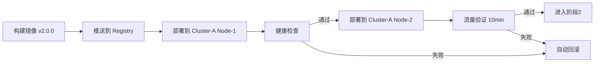
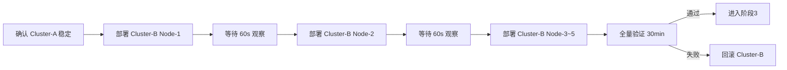

# 🦞 EvoClaw 跨3集群滚动部署编排方案

> 创建时间：2026-05-24
> 目标：在不中断服务的前提下，将应用安全、可控地滚动部署到3个集群

---

## 📋 一、集群概览

| 集群名称 | 环境 | 节点数 | 区域 | 健康检查端点 | 负载均衡器 |
|---------|------|--------|------|-------------|-----------|
| **Cluster-A** 🟢 | 金丝雀/预发布 | 2 | 华北 | `/health` | Nginx |
| **Cluster-B** 🔵 | 生产-主 | 5 | 华北 | `/health` | ALB |
| **Cluster-C** 🟣 | 生产-备 | 5 | 华东 | `/health` | ALB |

---

## 📦 二、部署策略

### 2.1 部署顺序

```
Cluster-A (金丝雀)  ──验证通过──▶  Cluster-B (生产主)  ──验证通过──▶  Cluster-C (生产备)
    ↓                       ↓                       ↓
  验证 10 分钟            验证 30 分钟            验证 30 分钟
  10% 流量                50% → 100%              50% → 100%
```

### 2.2 滚动更新参数

| 参数 | Cluster-A | Cluster-B | Cluster-C |
|------|-----------|-----------|-----------|
| 最大不可用节点 | 1 (50%) | 1 (20%) | 1 (20%) |
| 最大超出节点 | 1 | 2 | 2 |
| 批次暂停时间 | 30s | 60s | 60s |
| 每批次节点数 | 1 | 1 | 1 |
| 健康检查超时 | 10s | 30s | 30s |
| 健康检查间隔 | 5s | 10s | 10s |

---

## 🔄 三、部署流程

### 阶段 1：Cluster-A 金丝雀部署



**操作步骤：**

```
1. 构建镜像并推送
   docker build -t evoclaw:v2.0.0 .
   docker push registry.evoclaw.com/evoclaw:v2.0.0

2. 部署到 Cluster-A
   kubectl config use-context cluster-a
   kubectl set image deployment/evoclaw-server evoclaw-server=registry.evoclaw.com/evoclaw:v2.0.0
   kubectl rollout status deployment/evoclaw-server --timeout=5m

3. 健康检查
   curl -f http://cluster-a-canary.evoclaw.com/health

4. 流量验证 (10分钟)
   - 检查错误率 < 0.1%
   - 检查 P99 延迟 < 500ms
   - 检查日志无 ERROR 级别异常
```

### 阶段 2：Cluster-B 生产主部署



**操作步骤：**

```
1. 逐个节点滚动更新
   kubectl config use-context cluster-b
   
   # 分批更新 (每批1个节点，间隔60s)
   kubectl patch deployment evoclaw-server -p \
     '{"spec":{"strategy":{"rollingUpdate":{"maxUnavailable":1,"maxSurge":2}}}}'

   kubectl set image deployment/evoclaw-server \
     evoclaw-server=registry.evoclaw.com/evoclaw:v2.0.0

   # 监控 rollout 进度
   kubectl rollout status deployment/evoclaw-server --watch=true

2. 灰度流量验证
   - 50% 流量阶段：验证 15 分钟
   - 100% 流量阶段：验证 15 分钟

3. 指标验证
   - HTTP 5xx 错误率 < 0.05%
   - 平均响应时间 < 200ms
   - CPU/内存使用率 < 80%
```

### 阶段 3：Cluster-C 生产备部署

**操作步骤：**

```
1. 部署到 Cluster-C
   kubectl config use-context cluster-c
   kubectl set image deployment/evoclaw-server \
     evoclaw-server=registry.evoclaw.com/evoclaw:v2.0.0
   kubectl rollout status deployment/evoclaw-server --timeout=10m

2. 验证 30 分钟
   - 跨区域延迟测试
   - 数据一致性检查
   - 故障转移测试
```

---

## 🩺 四、健康检查清单

每个节点部署后必须通过以下检查：

```json
{
  "checks": [
    {
      "name": "服务存活检查",
      "command": "curl -sf http://{node}:3000/health",
      "expected": "{\"status\":\"ok\"}",
      "retries": 3,
      "interval_seconds": 5
    },
    {
      "name": "API 功能检查",
      "command": "curl -sf http://{node}:3000/api/skills",
      "expected": "HTTP 200",
      "retries": 3,
      "interval_seconds": 10
    },
    {
      "name": "数据库连接检查",
      "command": "curl -sf http://{node}:3000/health/db",
      "expected": "{\"db\":\"connected\"}",
      "retries": 2,
      "interval_seconds": 10
    },
    {
      "name": "LLM 服务检查",
      "command": "curl -sf http://{node}:3000/health/llm",
      "expected": "{\"llm\":\"ready\"}",
      "retries": 2,
      "interval_seconds": 15
    }
  ]
}
```

---

## ⏪ 五、回滚机制

### 5.1 自动回滚触发条件

| 指标 | 阈值 | 触发动作 |
|------|------|---------|
| HTTP 5xx 错误率 | > 1% (持续30s) | 暂停当前批次，回滚上一批次 |
| P99 延迟 | > 1000ms (持续1min) | 暂停部署，回滚当前节点 |
| 健康检查失败 | 连续3次失败 | 标记节点异常，回滚该节点 |
| 内存使用率 | > 90% | 暂停部署，回滚上一批次 |

### 5.2 回滚命令

```bash
# 回滚 Cluster-A
kubectl config use-context cluster-a
kubectl rollout undo deployment/evoclaw-server

# 回滚 Cluster-B
kubectl config use-context cluster-b
kubectl rollout undo deployment/evoclaw-server

# 回滚 Cluster-C
kubectl config use-context cluster-c
kubectl rollout undo deployment/evoclaw-server

# 回滚到指定版本
kubectl rollout undo deployment/evoclaw-server --to-revision=3
```

### 5.3 回滚验证

```bash
# 确认回滚完成
kubectl rollout status deployment/evoclaw-server

# 验证旧版本正常运行
curl -f http://{cluster}/health
```

---

## 📊 六、监控与通知

### 6.1 部署过程监控

```
部署进度仪表板: http://monitor.evoclaw.com/d/rollout
实时日志:       kubectl logs -f deployment/evoclaw-server -c evoclaw-server
事件监控:       kubectl get events --watch
```

### 6.2 通知渠道

| 阶段 | 通知对象 | 渠道 | 通知内容 |
|------|---------|------|---------|
| 部署开始 | 全体团队 | 飞书/企业微信 | 版本号、部署顺序、预计时间 |
| 每批次完成 | 运维组 | 飞书 | 批次节点、检查结果 |
| 阶段完成 | 全体团队 | 飞书/邮件 | 阶段总结、指标数据 |
| 异常/回滚 | 值班人员 | 电话+飞书 | 异常原因、影响范围、回滚状态 |
| 全部完成 | 全体团队 | 飞书/邮件 | 部署总结报告 |

---

## 🚦 七、部署命令速查

### 7.1 一键部署脚本

```bash
#!/bin/bash
# deploy-rolling.sh - 跨3集群滚动部署脚本

set -e

VERSION=${1:-"v2.0.0"}
REGISTRY="registry.evoclaw.com"

echo "========================================="
echo "  EvoClaw Rolling Deployment - $VERSION"
echo "========================================="

# 阶段1：Cluster-A 金丝雀
echo ">>> [阶段1] 部署到 Cluster-A (金丝雀)"
kubectl config use-context cluster-a
kubectl set image deployment/evoclaw-server \
  evoclaw-server=$REGISTRY/evoclaw:$VERSION
kubectl rollout status deployment/evoclaw-server --timeout=5m
echo ">>> Cluster-A 部署完成，等待 10 分钟验证..."
sleep 600

# 阶段2：Cluster-B 生产主
echo ">>> [阶段2] 部署到 Cluster-B (生产主)"
kubectl config use-context cluster-b
kubectl set image deployment/evoclaw-server \
  evoclaw-server=$REGISTRY/evoclaw:$VERSION
kubectl rollout status deployment/evoclaw-server --timeout=15m
echo ">>> Cluster-B 部署完成，等待 30 分钟验证..."
sleep 1800

# 阶段3：Cluster-C 生产备
echo ">>> [阶段3] 部署到 Cluster-C (生产备)"
kubectl config use-context cluster-c
kubectl set image deployment/evoclaw-server \
  evoclaw-server=$REGISTRY/evoclaw:$VERSION
kubectl rollout status deployment/evoclaw-server --timeout=15m

echo "========================================="
echo "  ✅ 全部3个集群部署完成！"
echo "  版本: $VERSION"
echo "========================================="
```

### 7.2 快速回滚脚本

```bash
#!/bin/bash
# rollback-all.sh - 全集群回滚脚本

echo ">>> 回滚所有集群到上一版本"

for ctx in cluster-a cluster-b cluster-c; do
  echo "回滚 $ctx ..."
  kubectl config use-context $ctx
  kubectl rollout undo deployment/evoclaw-server
  kubectl rollout status deployment/evoclaw-server --timeout=5m
  echo "$ctx 回滚完成"
done

echo ">>> 全部集群回滚完成"
```

---

## ⏱ 八、时间线预估

| 阶段 | 操作 | 预计耗时 |
|------|------|---------|
| 阶段1 | Cluster-A 部署 + 验证 | ~15 分钟 |
| 阶段2 | Cluster-B 滚动(5节点) + 验证 | ~40 分钟 |
| 阶段3 | Cluster-C 滚动(5节点) + 验证 | ~40 分钟 |
| **总计** | **全流程** | **~95 分钟** |

---

## 📝 九、部署检查清单

- [ ] 确认所有集群的 kubectl 上下文配置正确
- [ ] 确认 Docker 镜像已推送至 Registry
- [ ] 确认数据库 Schema 已迁移（如需）
- [ ] 确认配置中心已更新新版本配置
- [ ] 确认监控告警已就绪
- [ ] 确认回滚脚本可执行
- [ ] 确认值班人员已通知
- [ ] 确认备份已完成
- [ ] 确认服务降级策略已准备

---

## 📌 十、总结

本方案采用 **金丝雀 → 生产主 → 生产备** 的渐进式滚动部署策略：

1. **安全性**：先在小范围（Cluster-A，2节点）验证，再逐步扩大到生产集群
2. **可控性**：每批次仅更新1个节点，批次间有观察窗口，异常自动暂停
3. **可观测性**：全流程健康检查 + 指标监控 + 多渠道通知
4. **可回滚**：每阶段都保留回滚能力，一键回滚到上一版本
5. **时间可控**：全流程约95分钟，可根据实际验证情况调整等待时间

> 💡 **建议**：首次部署到新环境时，可适当延长验证时间；后续迭代可根据历史稳定性数据缩短验证窗口。
